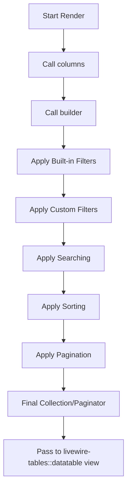

# Internal Architecture 🏗️

This document explains the internal design, patterns, and architectural decisions behind the `SkywalkerLabs\LaravelLivewireTables` package.

## Core Design Philosophy

The component is designed around **Composition over Inheritance**, strictly utilizing Laravel's Trait system to provide modular features while keeping the main `DataTableComponent` clean and manageable.

## The Trait System (Mixins)

The package uses a "God Trait" pattern via `SkywalkerLabs\LaravelLivewireTables\Concerns\HasAllTraits`. This trait acts as an aggregator for over 25 individual traits that each handle a specific feature.

### Key Functional Areas:
- **`WithColumns`**: Manages the column registration and visibility.
- **`WithData`**: Handles the interaction with the Eloquent Query Builder and data retrieval.
- **`WithFilters`**: Manages the life cycle and state of data filters.
- **`WithSorting` & `WithSearch`**: Injects logic directly into the Eloquent query before execution.
- **`WithPagination`**: Integrates Laravel’s native `LengthAwarePaginator`, `Paginator`, or `CursorPaginator`.

## Component Lifecycle & Hooks

The component hooks into the standard Livewire lifecycle but exposes its own specific hooks for extensibility.

### 1. Configuration Phase (`configure()`)
The `configure()` method is called during the initial component boot. This is where you call "Setters" to define the behavior of the table (e.g., `setPrimaryKey`, `setSearchEnabled`).

### 2. Column Registration (`columns()`)
This method must return an array of `SkywalkerLabs\LaravelLivewireTables\View\Column` instances. These are used for both rendering the table headers and fetching data.

### 3. Query Construction (`builder()`)
The `builder()` method returns an `Illuminate\Database\Eloquent\Builder`. This is the base query that the package will further modify by applying sorts, filters, and searches.

### 4. Rendering Hooks (`callRenderingHooks`)
Every time the table renders, it iterates through a set of "Rendering Hooks" to provide the final view with necessary data from each trait (e.g., `renderingWithColumns`, `renderingWithPagination`).

## Data Pipeline

When a table is rendered, it follows this logical pipeline:

## View Layer

The views are organized by theme (Tailwind, Bootstrap 4, Bootstrap 5). Each trait provides its own small "partials" that are injected into the main `datatable.blade.php`.

- **Component Utilities**: `src/Concerns/ComponentUtilities.php` handles theme detection and UI-related helpers.
- **Frontend Assets**: Handled by `src/Assets/SkywalkerLabsFrontendAssets.php`, which manages the injection of necessary scripts and styles into the global Livewire stack.

---

### Key Architectural Guidelines for Contributors:
- **Avoid bloating `DataTableComponent`**: If a new feature is added, create a new trait in `src/Concerns`.
- **Prefer DTOs**: Use Data Transfer Objects for passing complex configurations between traits.
- **Strict Typing**: All new methods must have return types and property types.
- **Blade Consistency**: Ensure any UI changes are reflected across all three supported themes (Tailwind, BS4, BS5).
